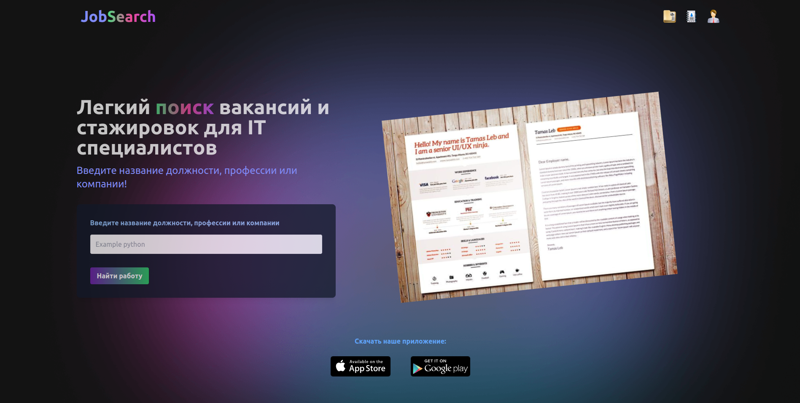

# Проект job-search для поиска работы

Для регистрации и авторизации, мы воспользуемся сервисом [Mokky](https://mokky.gitbook.io/welcome/ "Mokky")

>Mokky — это простой сервис, который позволяет вам легко создавать тестовое API для ваших пет-проектов, генерировать пользовательские данные и манипулировать этими данными с помощью готовых RESTApi-мет

## Задачи проекта
- [x] Регистрация 
- [x] Авторизация
- [ ] Создание профиля

## Используемые инструменты
+ Vue3
+ Pinia
+ Router
+ Mokky
+ Tailwind

